# Networking

- an FQDN, Fully Qualified Domain Name (www.hackthebox.eu) only specifies the address of the "building" and
- an URL (https://www.hackthebox.eu/example?floor=2&office=dev&employee=17) also specifies the "floor," "office," "mailbox" and the corresponding "employee" for whom the package is intended.

## Network types

**Wide Area Network (WAN)**

- The Internet
- a large number of LANs joined together
- Company Internal WAN - Intranet, Airgap Network, etc.
- To identify if the network is a WAN is to use a WAN specific routing protocal such as BGP and if the IP Schema in use is not within RFC 1918 (10.0.0.0/8, 172.16.0.0/12, 192.168.0.0/16).

**Local Area Network (LAN) and Wireless Local Area Network (WLAN)**

- LAN - Internal Networks (e.g Home or Office)
- WLAN - Internal Networks accessible over WiFi
- Will typically assign IP addresses designated for local use (RFC 1918, 10.0.0.0/8, 172.16.0.0/12, 192.168.0.0/16)
- In some cases, like some colleges or hotels, you may be assigned a routable (internet) IP Address from joining their LAN, but that is much less common.
- There's nothing different between a LAN or WLAN, other than WLAN's introduce the ability to transmit data without cables. It is mainly a security designation.

**Virtual Private Networks (VPN)**

- Connects multiple network sites to one LAN
- The goal is to make the user feel as if they were plugged into a different network.

Site-To-Site VPN

- both client and server are Network Devices, typically routers or firewalls, and share entire network ranges. Most commonly used to join company networks together over the internet, allowing multiple locations to communicated over the Internet as if they were local.

Remote Access VPN

- Client's computer creates a virtual interface that behaves as if it is on a client's network
- When analyzing these VPNs, an important piece to consider is the routing table that is created when joining the VPN. If the VPN only creates routes for specific networks (ex: 10.10.10.0/24), this is called a Split-Tunnel VPN, meaning the Internet connection is not going out of the VPN. For a company, split-tunnel VPN's are typically not ideal because if the machine is infected with malware, network-based detection methods will most likely not work as that traffic goes out the Internet.

SSL VPN

- This is a VPN that is done within our web browser and is becoming increasingly common as web browsers are becoming capable of doing anything.
- Typically these will stream applications or entire desktop sessions to your web browser. A great example of this would be the HackTheBox Pwnbox.

**Global Area Network (GAN)**

- Global network, internet
- GANs use the glass fibers infrastructure of wide-area networks and interconnect them by international undersea cables or satellite transmission.

**Metropolitan Area Network (MAN)**

- Regional network (multiple LANs)
- MAN is a broadband telecommunications network that connects several LANs in geographical proximity. As a rule, these are individual branches of a company connected to a MAN via leased lines.
- The transmission speed between two remote nodes is comparable to communication within a LAN.
- Internationally operating network operators provide the infrastructure for MANs. Cities wired as Metropolitan Area Networks can be integrated supra-regionally in Wide Area Networks (WAN) and internationally in Global Area Networks (GAN).

**Wireless Personal Area Network (WPAN)**

- Modern end devices such as smartphones, tablets, laptops, or desktop computers can be connected ad hoc to form a network to enable data exchange. This can be done by cable in the form of a Personal Area Network (PAN).
- based on Bluetooth or Wireless USB technologies
- A wireless personal area network that is established via Bluetooth is called Piconet
- PANs and WPANs usually extend only a few meters and are therefore not suitable for connecting devices in separate rooms or even buildings.
- In the context of the Internet of Things (IoT), WPANs are used to communicate control and monitor applications with low data rates. Protocols such as Insteon, Z-Wave, and ZigBee were explicitly designed for smart homes and home automation.

## Networking topologies

Physical or logical connection of devices in a network. Include network components such as switches, bridges and routers.

### Connections

Wired connections: Coaxial cabling, glass fiber cabling, twisted pair cabling
Wireless connections: Wi-Fi, Cellular, Satelite

### Nodes - Network Interface Controller (NICs)

Network nodes are the transmission medium's connection points to transmitters and receivers of electrical, optical, or radio signals in the medium.

Repeaters
Hubs
Bridges
Switches
Router/Modem
Gateways
Firewalls

### Classifications

We can imagine a topology as a virtual form or structure of a network. This form does not necessarily correspond to the actual physical arrangement of the devices in the network. Therefore these topologies can be either physical or logical. For example, the computers on a LAN may be arranged in a circle in a bedroom, but it is very unlikely to have an actual ring topology.

#### Point-to-Point

Connection between two hosts - physical link. Point-to-poin are the beasic model of traditional telephony and must not be confused with Peer-to-Peer architecture.

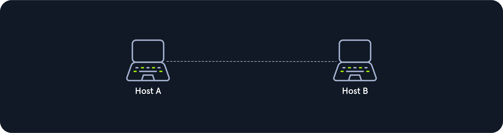

#### Bus

All hosts are connected via a tramission medium in the bus topology. Every host has access to the transmission medium and the signals that are transmitted over it. Transmission medium can be a e.g. coaxial cable.

Since the medium is shared with all the others, only one host can send, and all the others can only receive and evaluate the data and see whether it is intended for itself.

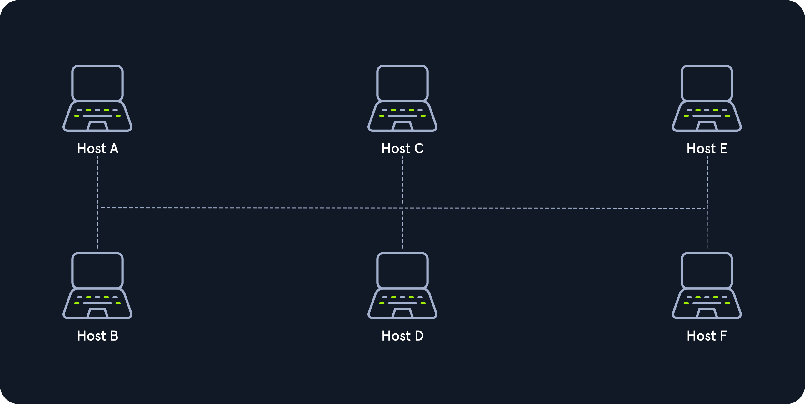

#### Star

Each host is connected to the central network component via a separate link. This is usually a router, hub or a switch. These handle forwarding function for the data packets.

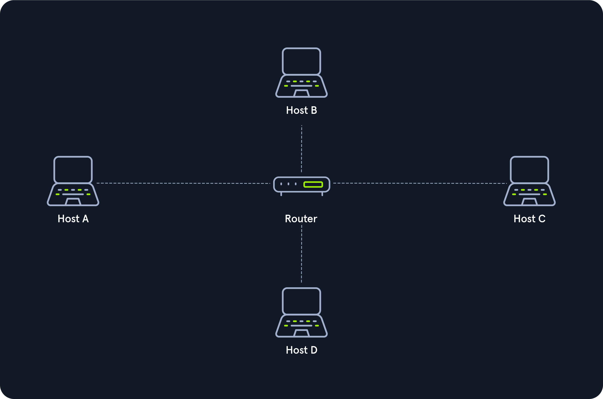

#### Ring

The physical ring topology is such that each host or node is connected to the ring with two cables:

- one for the incoming signals
- one for the outgoing signals

The ring topology does not require and active network component. The control and access to the transmission medium are regulated by a protocol to which all stations adhere.

The informations is transmitted in a predetermined transmission direction. Typically, the transmissin medium is accessed sequentially from station to station using a retrieval system from the central station or a token.

A token is a bit pattern that continually passes through a ring network in one direction, which works according to the claim token process.

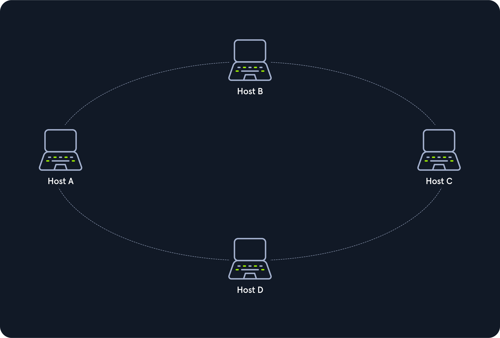

#### Mesh

Many nodes decided about the connections on a physical level and the routing on a logical level in meshed networks. No fixed topology.

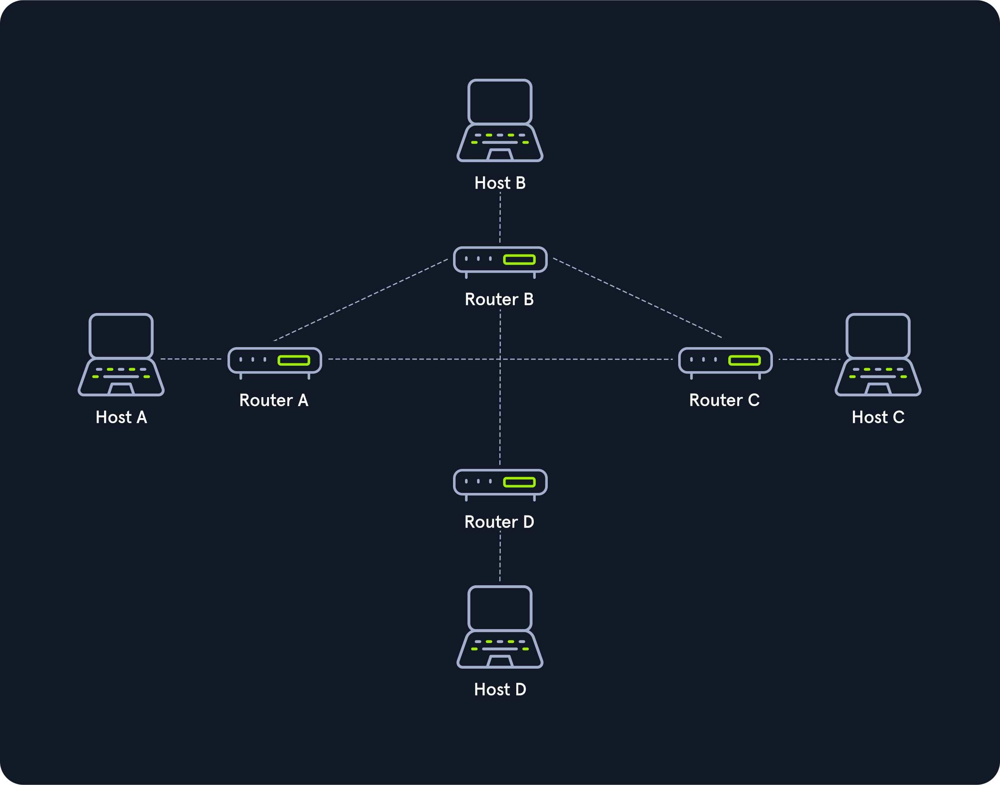

**Fully meshed**

Each host is connected to every other host in the network in a fully meshed structure. Hosts are meshed with each other. Used in WAN or MAn to ensure high reliability and bandwitdth.

Routers can be networked together in case of one failure others can continue working.

Each node has the same routing functions and knows the neighbouring nodes it can communicate with proximity to the network gateway and traffic loads.

**Partially meshed**

The edpoints are connected by only one connection. Specific nodes are connected to exactly one other node, and some other nodes are connected to two or more other nodes with point-to-point connection.

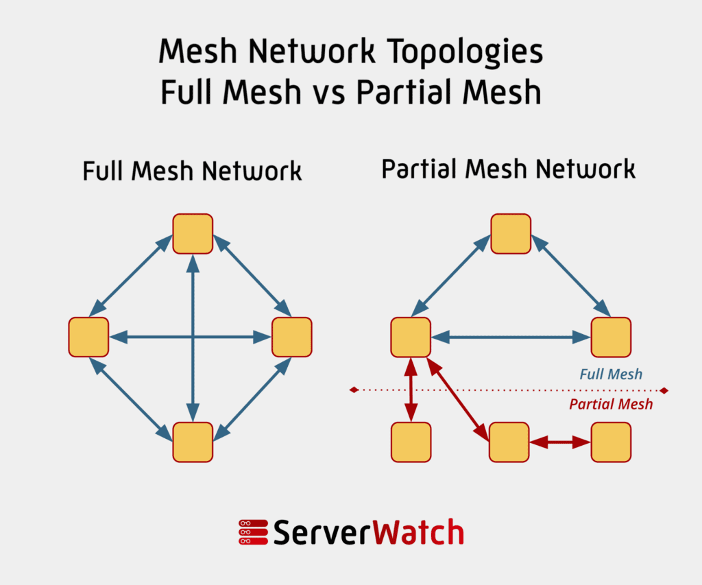

#### Tree

Used in larger company buildings, extended start topology.

There are both logical and physical tree structures. Modular modern networks, based on structured cabling with a hub hierarchy, also have a tree structure.

Tree topologies are also used for broadband networks and city networks (MAN).

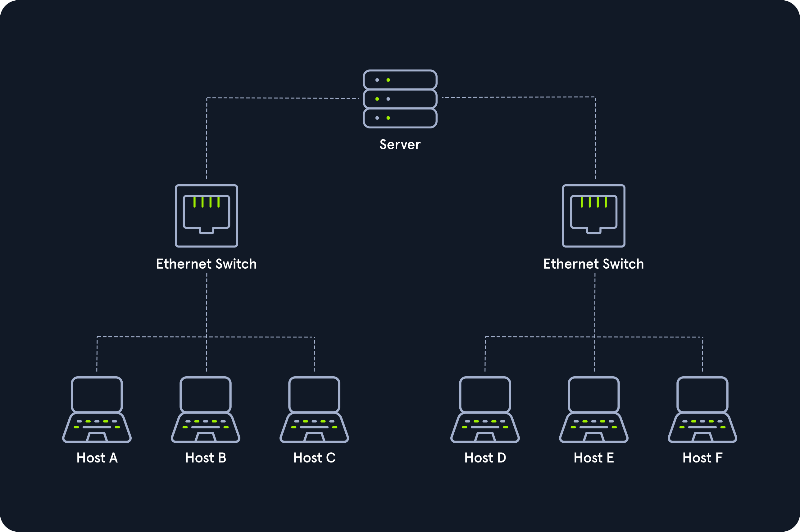

#### Hybrid

Combine two or more topologies that the resulting network does not present any standard topologies.

E.g. tree network can represent a hybrid topology in which star networks are connected via interconnected bus networks.

A tree network linked to another tree network is still topologically a tree network.

A hybrid topology is always created when two different basic network topologies are interconnected.

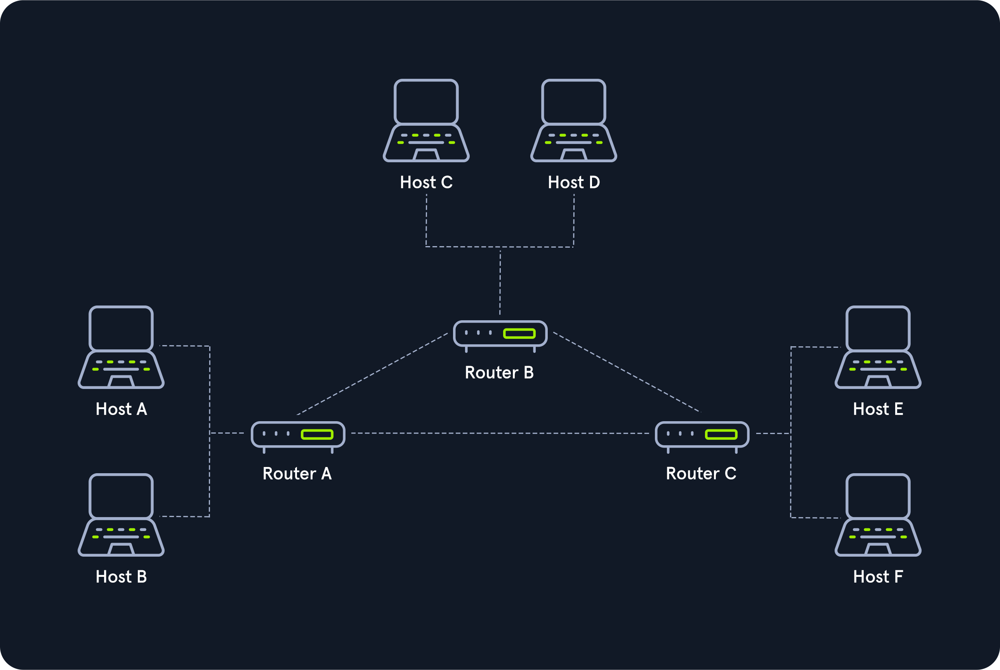

#### Daisy Chain

Multiple hosts are connected by placing a cable from one node to another. This creates a chain of connections, multiple hardware components are connected in a series.

Often used for automation technology - CAN.

Daisy chaining is based on a physical arrangements of nodes, in contrast to token procedures, which are structural but can be made independent of the physical layout. The signal is sent to and from a component via its previous nodes to the computer system.

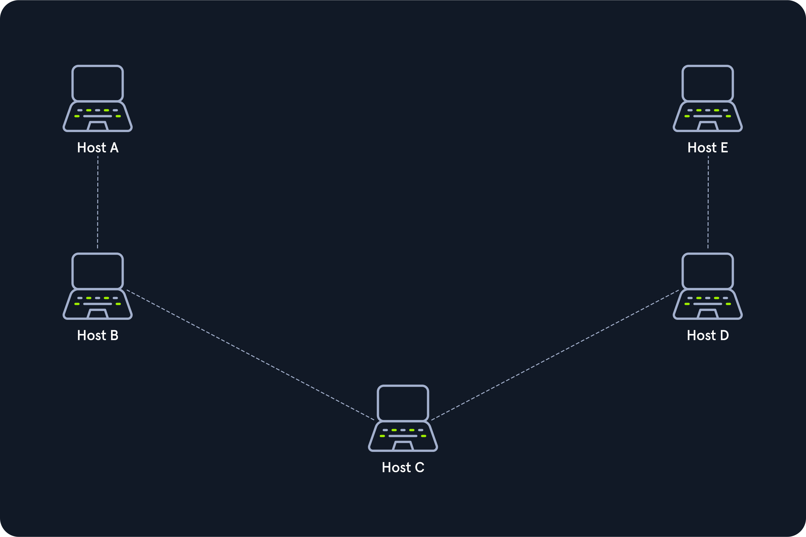

## Proxies

Proxy is when a device or service sits in the miffle of a connection and acts as a mediator (must be able to inspect the contents of the traffic). Without the ability to be a mediator, the device is technically a gateway, not a proxy.

Proxies operate at Layer 7 of the OSI Model.

### Dedicated Proxy / Forward Proxy

Forward Proxy is when a client makes a request to a computer, and that computer carries out the request.

The malware has to be proxy aware in order to cause harm when a proxy is in use.

Firefox uses `libcurl`, which means the malware would have to look for Firefox and pull the proxy settings, which malware is highly unlikely to do.

Burp Suite - forwards HTTP Requests, can be configured to be a reverse proxy or transparent.

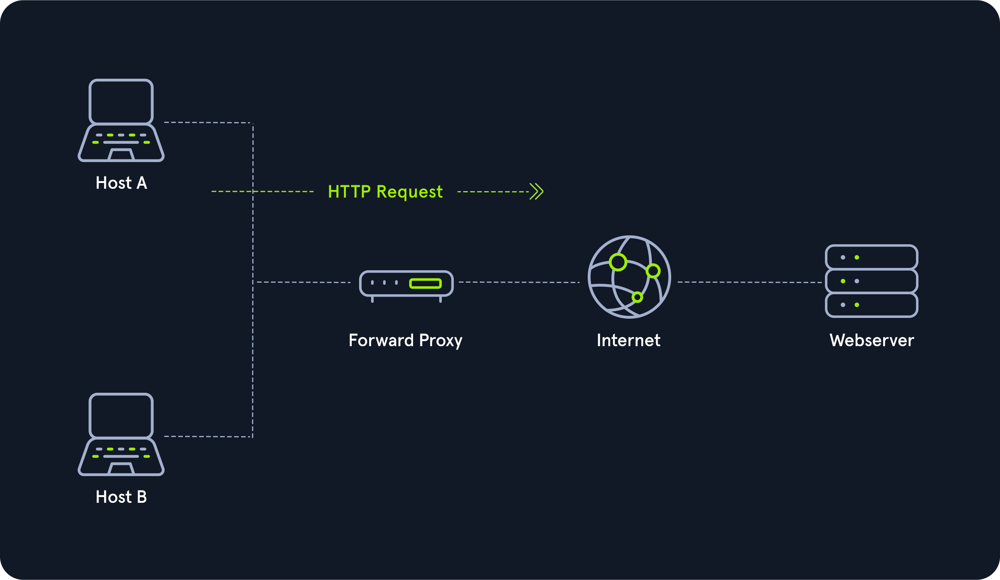

### Reverse Proxy

Reverse proxy is the reverse of a Forward Proxy, it filters incoming requests. The most common goal is to listen on an address and forward it to a closed-off network.

**CloudFlare** - many organizations use it as they have a robust network that can withstand DDOS attacks. Cloudflare provides organizations with an ability to filter traffic that gets sent to their webservers.

**Intrusion Detection Systems** - watches external web requests in organization.

Penetration testers use reverse proxies on compromised endpoints to redirect and hide their activities, especially when gaining access via SSH, to bypass firewalls and evade detection by IDS that may be monitoring external web requests.

**ModSecurity** - another common reverse proxy.

**Web Application Firewall (WAF)** - inspect web requests for malicious content and block the request if it is malicious. Cloudflare can act as a WAF but doing so requires letting them decrypt HTTPS traffic.

### (Non) Transparent Proxy

All the proxies act either transparently or non transparently.

**Transparent proxy**

- client doesn't know about it's existence
- intercepts the client's communication requests to the Internet and acts as a substitute instance
- to the outside, acts as a communication pattern

**Non transparent proxy**

- we must be informed about its existence
- we and the software we want to use are given a special proxy configuration that ensures that traffic to the Internet is first addressed to the proxy. If this configuration does not exist, we cannot communicate via the proxy.

## Networking Models

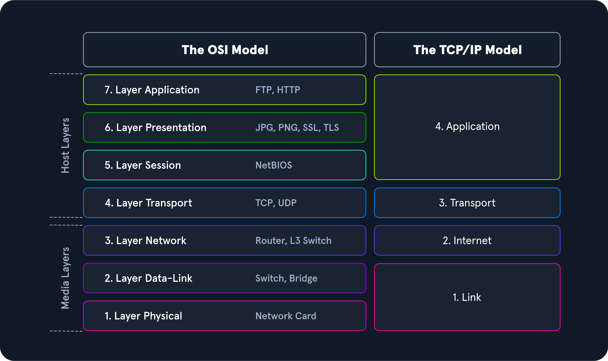

## The ISO/OSI Model

- Open Systems Interconnections
- International Organization for Standardization
- reference model that can be used to describe and define communication between systems

## The TCP/IP Model

- Transmission Control Protocol
- Internet Protocol
- Internet is entirely based on the TCP/IP protocol family
- ICMP - Internet Control Message Protocol
- UDP - User Datagram Protocol

**ISO/OSI vs TCP/IP**

TCP/IP is a communication protocol that allows hosts to connect to the Internet.

OSI is a communication gateway between the network and end-users. The OSI model is a reference model because it is newer and more widely used, strict protocol and limitations.

## Packet Transfers

**PDU** - protocol data unit.

Browse a website on the computer.

1. Request Processing:
   The computer sends a request to a remote server to browse a website.

2. Application Layer:
   The remote server's software processes the request at the application layer, handling specific functions.

3. Layer-by-Layer Processing:
   The data is processed layer by layer, each layer performing its designated tasks.

4. Network's Physical Layer:
   The processed data is then transferred through the physical layer of the network.

5. Data Reception:
   The destination server or another device receives the data.

6. Layered Routing Back:
   The received data is routed back through the layers, with each layer performing its assigned operations.

7. Final Processing:
   The data is processed until it reaches the application layer again.

8. Data Utilization:
   The receiving software uses the processed data for displaying the website content.

**Encapsulation** - During the transmission, each layer adds a header to the PDU from the upper layer, which controls and identifies the packet. The process continues to the Physical Layer or Network Layer, where the data is transmitted to the receiver. The receiver reverses the process and unpacks the data on each layer with the header information. After that, the application finally uses the data. This process continues until all data has been sent and received.

Ethernet - defines a set of standards for how devices in a local are network (LAN) communicate with each other.

With TCP/IP we can quickly understand how the entire connection is established. With ISO we can take it apart and analyze it in detail.

## The OSI Model

### Physical Layer (Layer 1):

Task: Transmission of data using techniques like electrical signals, optical signals, or electromagnetic waves.
Example: Sending data over wired or wireless transmission lines.

### Data Link Layer (Layer 2):

Task: Ensuring reliable and error-free transmissions by dividing bitstreams into blocks or frames.
Example: Managing data transmission on a specific medium.

### Network Layer (Layer 3):

Task: Establishing connections in circuit-switched networks and forwarding data packets in packet-switched networks.
Example: Routing data from sender to receiver across the entire network.
Responsibilities:

- Establishing connections in circuit-switched networks.
- Forwarding data packets in packet-switched networks.
- Handling logical addressing (IP addresses).

Example: The Internet Protocol (IP) operates at the network layer, determining the logical addressing and routing of packets between different networks.

### Transport Layer (Layer 4):

Task: Controlling end-to-end data transfer, detecting and avoiding congestion situations, and segmenting data streams.
Example: Ensuring reliable delivery and managing data flow. Works with port numbers to distinguish different communication channels between applications.
Responsibilities:

- Segmenting and reassembling data.
- Detecting and recovering from errors.
- Managing flow control and congestion.

Examples: Transmission Control Protocol (TCP) and User Datagram Protocol (UDP) operate at the transport layer. TCP ensures reliable data delivery with error checking and retransmission, while UDP provides a connectionless and faster delivery option without guaranteed reliability.

### Session Layer (Layer 5):

Task: Controlling logical connections between two systems to prevent connection breakdowns or other problems.
Example: Managing and maintaining sessions between devices.

### Presentation Layer (Layer 6):

Task: Transferring system-dependent data presentations into a form independent of the application.
Example: Ensuring compatibility between different systems' data representations.

### Application Layer (Layer 7):

Task: Controlling input and output of data and providing application functions.
Example: Managing user interfaces, file transfers, and other application-level interactions.

## TCP/IP Model

- layered reference model, often referred to as the Internet Protocol Suite.
- TCP, Transmission Control Protocol, transport layer, ensures the connection between data stream and application.
- IP, Internet Protocol, is located within the network layer, ensures that the packet reaches its destination.

### 1. Link Layer

- reponsible for placing TCP/IP packets on the network medium and receiving correspondnig packets from the network medium
- TCP/IP is designed to work independently of the network access method, frame format, and medium

### 2. Internet

- responsible for host addressing, packaging and routing functions

### 3. Transport

- provides TCP session and UDP datagram services for the Application Layer

### 4. Application

- allows applications to access the other layers and defined the protocols applications use to exchange data

### IP

**Logical addressing**

- network classes, subnetting, CIDR
- many hosts in different network -> need to structure the network topology

**Routing**

- for each data packet, the next node is determined in each node on the way from the sender to receiver
- this way the data packet can be routed to the receiver even if its location is unkown to the sender

### TCP

**Error and Control Flow**

- control messages are sent continuously to check if the connection is still established between the sender and receiver

**Application support**

- TCP and UDP ports form a software abstraction to distinguish specific applications and their communication links.

### DNS

**Name resolution**

- DNS provides name resolution through FQDN in IP addresses
